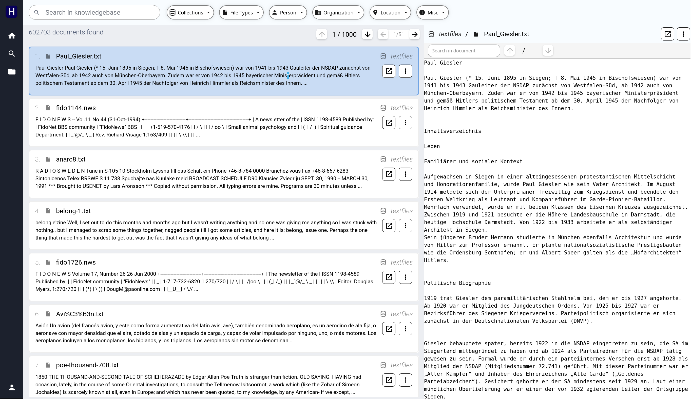

# Hoover4

Hoover4 is a prototype tool by [Liquid Investigations](https://liquid-investigations.org/index.html). More information is available on the [Wiki Site](https://github.com/liquidinvestigations/docs/wiki).

Hoover4 will supersede the legacy [hoover-search](https://github.com/liquidinvestigations/hoover-search) project.

---

## [Live Demo](https://liquiddemo.org/)

<a href="https://new.liquiddemo.org" target="_blank"> </img></a>

A live demo website for this prototype is available at https://new.liquiddemo.org/.

A live demo website for the legacy project is also available at https://liquiddemo.org/.

---

## What is Hoover4?

Hoover4 is a self-hosted end-to-end document processing and search platform. It ingests heterogeneous file collections, made of archives, emails, PDFs, images, audio, video, and raw text, then extracts and normalizes their content, indexes structured and unstructured data, and exposes search and retrieval through a web application.

---

## Who is Hoover4 for?

Hoover4 is designed for investigative teams, analysts, and organizations that need to process, search, and analyze large heterogeneous document collections, while cross-referencing them with internal knowledge bases. Typical use cases include:

- Ingesting and deduplicating document archives at scale.
- Extracting text, metadata, and named entities from mixed-format collections.
- Performing keyword, semantic, and hybrid search across processed content.
- Exporting analysis-ready data products for downstream reporting and publication.
- Running on self-hosted, private cloud or offline environments; possibly on consumer-level hardware.
---

## Design Principles

### Staged pipeline architecture.

Processing is decomposed into discrete, independently scalable stages: filesystem scanning and deduplication, plan computation, plan execution and scheduling, type-specific parsing, and indexing. Each stage is a [Temporal](https://temporal.io/) workflow with dedicated worker queues. See the [processing code](main_services/processing/Readme.md) for more details.

### Content-type routing.

Files are classified by MIME type using multiple detectors ([`file`/`libmagic`](https://man7.org/linux/man-pages/man3/libmagic.3.html), [Tika](https://tika.apache.org/)/[Extractous](https://github.com/yobix-ai/extractous), [Magika](https://github.com/google/magika)) and dispatched to specialized parsers for archives, email, PDF, images, audio, video, OCR, and plain text. Containers (archives, emails with attachments) recursively spawn child ingestion workflows.

### Deduplication and blob-level storage.

File content is hashed (SHA3-256 primary; MD5, SHA1, SHA256 secondary) in a single streaming pass. Small blobs are stored inline in ClickHouse; large blobs are offloaded to MinIO. Processing operates on deduplicated blobs, not raw files.

### Separation of compute concerns.

Heavy workloads are isolated into dedicated task queues (common processing, Tika parsing, [EasyOCR](https://github.com/JaidedAI/EasyOCR), and text/vector indexing) to prevent resource contention and allow independent scaling.

### AI as a composable service layer.

Embedding, NER, reranking, and RAG capabilities are exposed as stateless HTTP APIs with LangChain-compatible client libraries, decoupled from the core ingestion pipeline.

---

## Software Components

The system is composed of three layers:

### [Main Services](main_services/Readme.md)

Data ingestion pipelines orchestrated by [Temporal](https://temporal.io/), backed by [ClickHouse](https://clickhouse.com/) (analytics/structured storage), [Manticore](https://manticoresearch.com/) (full-text search, vector search), [MinIO](https://www.min.io/) (object storage), [Tika](https://tika.apache.org/)/[Extractous](https://github.com/yobix-ai/extractous) (metadata/text extraction). A multi-stage [processing pipeline](main_services/processing/Readme.md) scans datasets, builds processing plans, parses files by type, runs OCR, and indexes results.

### [AI Services](ai_services/README.md)

GPU-accelerated FastAPI services providing multilingual embeddings, cross-encoder reranking, named entity recognition, a RAG pipeline with hybrid search and chat history, and a research agent with MCP tool integration.

### [Website](website/Readme.md)

A full-stack [Dioxus](https://dioxuslabs.com/) application (Rust backend, WASM frontend) that provides search, document viewing, file browsing, and chatbot interfaces over the indexed data.

---

## Installation

### Requirements

**Hardware (minimal requirements):**

- 1x GPU Node:
    - Minimum 1x NVIDIA RTX 3090 (24 GB VRAM) or equivalent.
    - 64 GB system RAM or more.
    - 8+ CPU cores.
- 1x Database Node:
    - 256 GB NVME storage (operating system & containers)
    - 1 TB SSD (SATA) storage (databases)
    - 6 TB HDD storage (objects, original data, backups)
    - 8+ CPU cores.
    - 64 GB system RAM or more.
- 1x Website Node:
    - 64 GB SSD (SATA) storage (operating system & containers)
    - 4+ CPU cores.
    - 16 GB system RAM.

**Software:**

For hosting:

- Debian 12 or 13.
- Docker and Docker Compose.
- `nvidia-docker` and CUDA 12.8 (for GPU-accelerated AI services).

For development:

- All of the above, and:
- Python 3.11+ with [uv](https://github.com/astral-sh/uv).
- Rust toolchain and [Dioxus CLI](https://dioxuslabs.com/).
- System utilities: `file`, `7z`, `qpdf`, `ffprobe`, `ffmpeg`.

### Deployment

1. **Start AI Services.** From `ai_services/`:

```bash
cp env.example .env
vim .env  # customize the IP addresses and options
docker compose up -d
```

The main server starts on port `8080` and provides embeddings, reranking, and NER endpoints.


2. **Start Main Services.** From `main_services/ops/docker/`:

```bash
cp env.example .env
vim .env  # customize the IP addresses and options
docker compose up -d
```

This brings up Temporal (with Cassandra and Elasticsearch), ClickHouse, Manticore, MinIO, Redis, Apache Tika, and monitoring UIs, as well as the main website on port `8080`.

---

## License

This project is licensed under the [GNU Affero General Public License v3.0](LICENSE) (AGPL-3.0). See the `LICENSE` file for the full text.

---

## FAQ


**What file formats does Hoover4 support?**

Archives (via 7z), email (RFC 822, mbox), PDF, images (with OCR), audio, video, and any format supported by Apache Tika. Container formats are recursively unpacked and their contents processed independently.

**How is data structured in Hoover4?**

Data is organized on two levels:

- Dataset: Individual batch of original data. This can conceptually be a scanned filesystem, a remote database, a group of scraped websites, or a stream of data from an external app. The dataset can be fixed (frozen) or continually updating. One or more datasets are grouped into a Collection (see below).
- Collection: Groups of multiple datasets. Access control and authorization works at this level.

**Can Hoover4 run without a GPU?**

The core ingestion pipeline (main services) does not require a GPU. AI services (embeddings, NER, reranking, RAG) do require GPU for execution.

**What LLM providers are supported for RAG?**

The RAG system uses LiteLLM and supports OpenAI, Anthropic, Ollama (local), VLLM (local) and any LiteLLM-compatible provider. Configuration is set via environment variables. The current prototype runs on a locally hosted VLLM, using the Qwen3 family of LLMs.

**How does deduplication work?**

Files are hashed during ingestion using SHA3-256. Blobs with identical hashes are stored once. Downstream processing operates on unique blobs rather than individual file copies.

**Where can I find architecture diagrams?**

See [`main_services/docs/Readme.md`](main_services/docs/Readme.md) for high-level process, data flow, and data representation diagrams.
