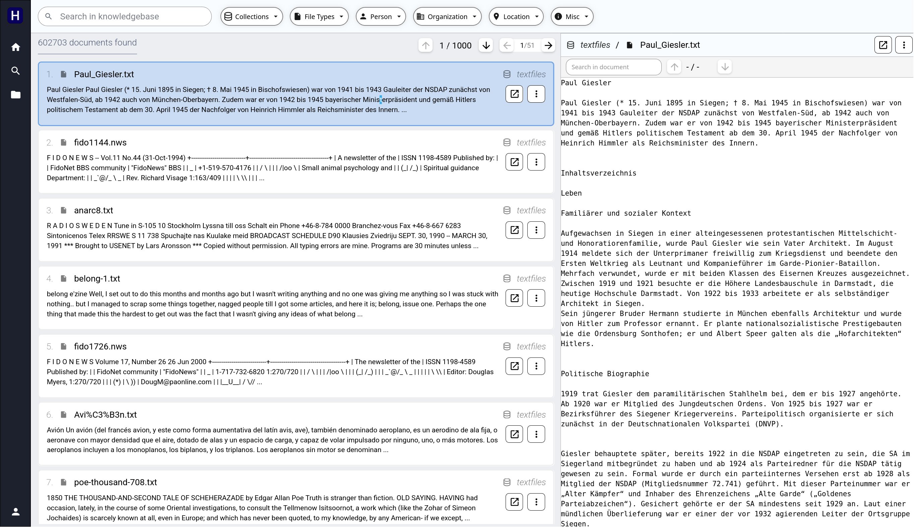

# Hoover4

Hoover4 is a prototype tool by [Liquid Investigations](https://liquid-investigations.org/index.html). More information is available on the [Wiki Site](https://github.com/liquidinvestigations/docs/wiki).

Hoover4 will supersede the legacy [hoover-search](https://github.com/liquidinvestigations/hoover-search) project.

---

## [Live Demo](https://liquiddemo.org/)

<a href="https://new.liquiddemo.org" target="_blank"> </img></a>

A live demo website for this prototype is available at https://new.liquiddemo.org/.

A live demo website for the legacy project is also available at https://liquiddemo.org/.

---

## What is Hoover4?

Hoover4 is a self-hosted end-to-end document processing and search platform. It ingests heterogeneous file collections, made of archives, emails, PDFs, images, audio, video, and raw text, then extracts and normalizes their content, indexes structured and unstructured data, and exposes search and retrieval through a web application.

---

## Who is Hoover4 for?

Hoover4 is designed for investigative teams, analysts, and organizations that need to process, search, and analyze large heterogeneous document collections, while cross-referencing them with internal knowledge bases. Typical use cases include:

- Ingesting and deduplicating document archives at scale.
- Extracting text, metadata, and named entities from mixed-format collections.
- Performing keyword, semantic, and hybrid search across processed content.
- Exporting analysis-ready data products for downstream reporting and publication.
- Running on self-hosted, private cloud or offline environments; possibly on consumer-level hardware.
---

## Design Principles

### Staged pipeline architecture.

Processing is decomposed into discrete, independently scalable stages: P0 filesystem scanning and deduplication, P1 plan computation, P2 plan execution and scheduling, P3 type-specific parsing, P4 named-entity extraction (NLP/NER against a remote service, on its own queue), and P5 indexing. Each stage is a [Temporal](https://temporal.io/) workflow with dedicated worker queues. See the [processing code](main_services/processing/Readme.md) for more details.

### Content-type routing.

Files are classified by MIME type using multiple detectors ([`file`/`libmagic`](https://man7.org/linux/man-pages/man3/libmagic.3.html), [Tika](https://tika.apache.org/)/[Extractous](https://github.com/yobix-ai/extractous), [Magika](https://github.com/google/magika)) and dispatched to specialized parsers for archives, email, PDF, images, audio, video, OCR, and plain text. Containers (archives, emails with attachments) recursively spawn child ingestion workflows.

### Deduplication and blob-level storage.

File content is hashed (SHA3-256 primary; MD5, SHA1, SHA256 secondary) in a single streaming pass. Small blobs are stored inline in ClickHouse; large blobs are offloaded to MinIO. Processing operates on deduplicated blobs, not raw files. In ClickHouse this data is partitioned per collection into `Hoover4_Collection_<collectionname>` databases, with only global state (users, groups, collections, the dataset registry, sessions, settings, search cache) in `Hoover4_Processing`.

### Sharded full-text indexes.

Manticore search indexes are sharded per collection: each shard is a `<collectionname>_<n>_pages` / `<collectionname>_<n>_meta` table pair that stays open until it would exceed `MAX_SHARD_TEXT_BYTES` (1 GB of extracted text), then seals. A ledger in the collection's ClickHouse database (`manticore_shards`, `manticore_shard_assignments`) records which shard owns each document, and the website fans searches out to the live shards and merges the results. See [tasks/Readme.md](main_services/processing/tasks/Readme.md).

### Separation of compute concerns.

Heavy workloads are isolated into dedicated task queues (common processing, Tika parsing, [EasyOCR](https://github.com/JaidedAI/EasyOCR), and text/vector indexing) to prevent resource contention and allow independent scaling.

### AI as a composable service layer.

Embedding, NER, reranking, and RAG capabilities are exposed as stateless HTTP APIs with LangChain-compatible client libraries, decoupled from the core ingestion pipeline.

---

## Software Components

The system is composed of three layers:

### [Main Services](main_services/Readme.md)

Data ingestion pipelines orchestrated by [Temporal](https://temporal.io/), backed by [ClickHouse](https://clickhouse.com/) (analytics/structured storage), [Manticore](https://manticoresearch.com/) (full-text search, vector search), [MinIO](https://www.min.io/) (object storage), [Tika](https://tika.apache.org/)/[Extractous](https://github.com/yobix-ai/extractous) (metadata/text extraction). A multi-stage [processing pipeline](main_services/processing/Readme.md) scans datasets, builds processing plans, parses files by type, runs OCR, and indexes results.

### [AI Services](ai_services/README.md)

The optional GPU tier: a FastAPI server providing multilingual embeddings, cross-encoder reranking and named entity recognition, GPU EasyOCR, and a parked local vLLM. Standalone — no dependency on the main stack; the MCP servers and research agents live in [`main_services/agents/`](main_services/agents/README.md).

### [Website](website/Readme.md)

A full-stack [Dioxus](https://dioxuslabs.com/) application (Rust backend, WASM frontend) that provides search, document viewing, file browsing, and chatbot interfaces over the indexed data.

---

## Installation

### Requirements

**Hardware (minimal requirements):**

- 1x GPU Node:
    - Minimum 1x NVIDIA RTX 3090 (24 GB VRAM) or equivalent.
    - 64 GB system RAM or more.
    - 8+ CPU cores.
- 1x Database Node:
    - 256 GB NVME storage (operating system & containers)
    - 1 TB SSD (SATA) storage (databases)
    - 6 TB HDD storage (objects, original data, backups)
    - 8+ CPU cores.
    - 64 GB system RAM or more.
- 1x Website Node:
    - 64 GB SSD (SATA) storage (operating system & containers)
    - 4+ CPU cores.
    - 16 GB system RAM.

**Software:**

For hosting:

- Debian 12 or 13.
- Docker and Docker Compose.
- `nvidia-docker` and CUDA 12.8 (for GPU-accelerated AI services).

For development:

- All of the above, and:
- Python 3.11+ with [uv](https://github.com/astral-sh/uv).
- Rust toolchain and [Dioxus CLI](https://dioxuslabs.com/).
- System utilities: `file`, `7z`, `qpdf`, `ffprobe`, `ffmpeg`.

### Deployment

Both stacks deploy from one `hoover4.ini` at the repository root, copied by hand to
both hosts (see `hoover4.ini.example` for the fully commented template):

```bash
cp hoover4.ini.example hoover4.ini
$EDITOR hoover4.ini      # ports, providers, secret file paths — never key values

./deploy                 # main_services: databases, worker, website, agents
./deploy --ai-services   # ai_services: the optional GPU tier (needs [ai_services] enabled = true)
./deploy --build         # rebuild images (force-recreates)
./deploy --reset         # wipe data volumes (model caches preserved unless --reset-caches)
./deploy --print-env     # show the generated .env, start nothing
```

`deploy.py` renders the ini into generated `.env` files next to each compose file
(never edit those by hand), preflights the machine (GPU/CDI, secret files, free
ports), and shells out to `docker compose`. The main stack brings up Temporal (with
Cassandra and Elasticsearch), ClickHouse, Manticore, MinIO, Redis, the processing
worker, the research agents and MCP servers, monitoring UIs, and the website on port
`12345`. The GPU tier is standalone: no shared network, no dependency on the main
host — the pipeline reaches it over the published ports in the ini.

Secrets never enter a compose file, a generated `.env` or a command line. The ini
holds *host paths* to key files (`chmod 600`, outside the checkout — `deploy.py`
refuses paths inside the repo, since those leak into build contexts); the deploy turns
each into a read-only bind mount, so a container learns the path and never the value.

`[main_services] serena_enabled` additionally starts a [Serena](https://github.com/oraios/serena)
MCP server on `127.0.0.1:21940` for the coding agents (`.mcp.json` points at it). It
is development tooling, not part of the stack: it runs as its own compose project
(`hoover4-devtools`) on its own network, so `./deploy --down` and `./deploy --reset`
cannot take it down mid-session, and its index volume survives a reset. It can read
and write the whole repository — never publish it off `127.0.0.1`.

---

## License

This project is licensed under the [GNU Affero General Public License v3.0](LICENSE) (AGPL-3.0). See the `LICENSE` file for the full text.

---

## FAQ


**What file formats does Hoover4 support?**

Archives (via 7z), email (RFC 822, mbox), PDF, images (with OCR), audio, video, and any format supported by Apache Tika. Container formats are recursively unpacked and their contents processed independently.

**How is data structured in Hoover4?**

Data is organized on two levels:

- Dataset: Individual batch of original data. This can conceptually be a scanned filesystem, a remote database, a group of scraped websites, or a stream of data from an external app. The dataset can be fixed (frozen) or continually updating. One or more datasets are grouped into a Collection (see below).
- Collection: Groups of multiple datasets. Access control and authorization works at this level.

**Can Hoover4 run without a GPU?**

The core ingestion pipeline (main services) does not require a GPU. AI services (embeddings, NER, reranking, RAG) do require GPU for execution.

**What LLM providers are supported for RAG?**

The RAG system uses LiteLLM and supports OpenAI, Anthropic, Ollama (local), VLLM (local) and any LiteLLM-compatible provider. Configuration is set via environment variables. The current prototype runs on a locally hosted VLLM, using the Qwen3 family of LLMs.

**How does deduplication work?**

Files are hashed during ingestion using SHA3-256. Blobs with identical hashes are stored once. Downstream processing operates on unique blobs rather than individual file copies.

**Where can I find architecture diagrams?**

See [`main_services/docs/Readme.md`](main_services/docs/Readme.md) for high-level process, data flow, and data representation diagrams.
